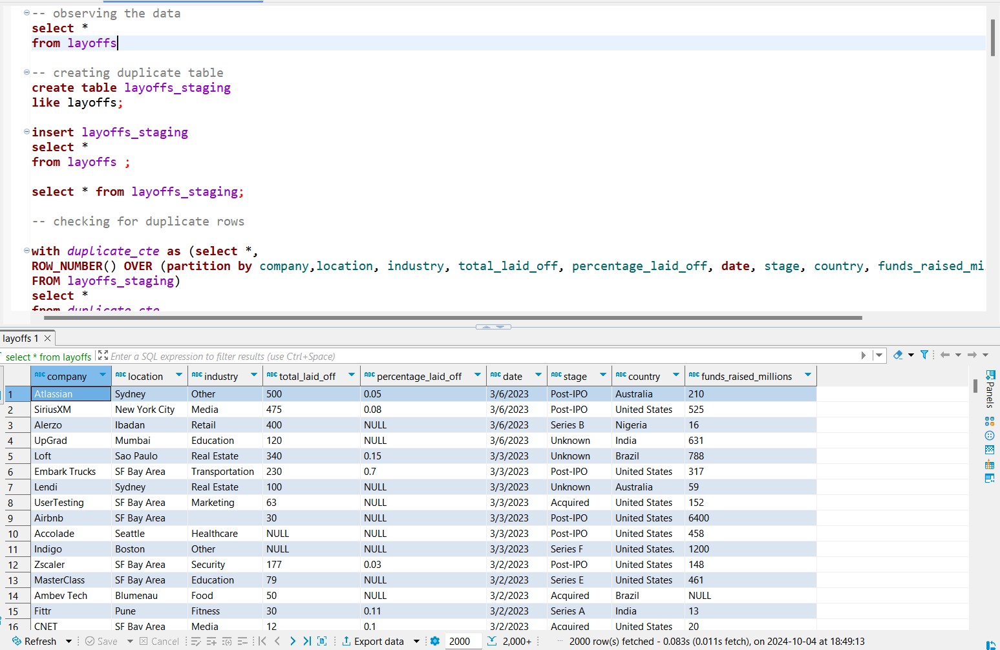

# DataCleaningInSQL
This dataset is about companies around the world that laid off employees from 2020-2023. I cleaned the dataset by performing the following steps:
- Deleted duplicate rows.
- Removed unnecessary spaces from strings.
- Standardised spellings.
-	Converted date column from string to date.
-	Populated empty values from existing data.
-	Converted empty strings to null
-	Deleted unrequired null rows and dropped unrequired columns.

